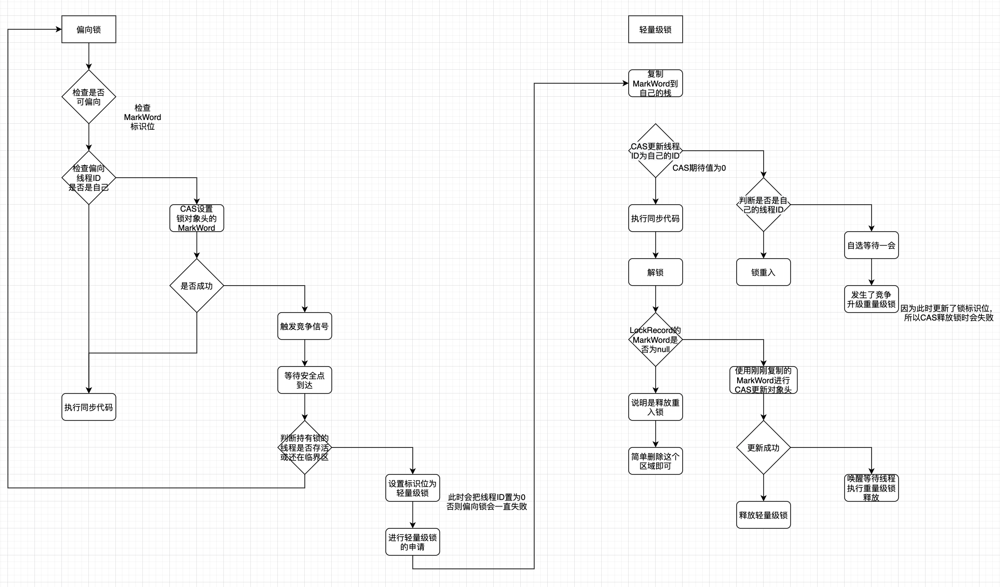
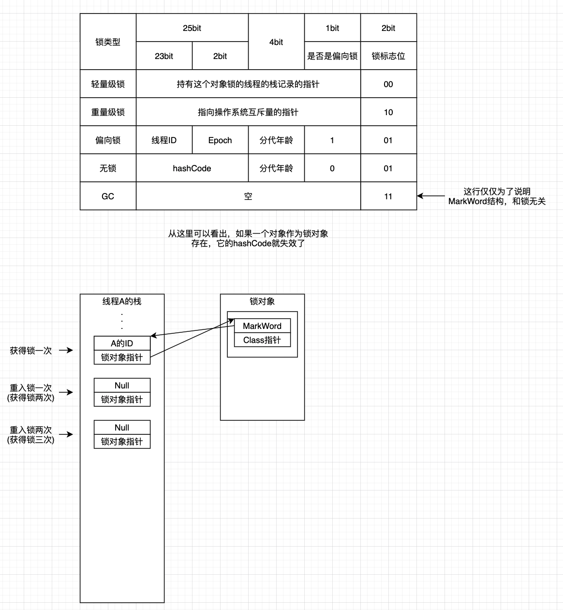

最近背八股文，发现自己对于Java的同步机制仅限于使用，和部分拾人牙慧般的底层理解。于是找了时间稍微梳理了一些，于今日进行总结叙述。

## 为什么需要并发？

如果你看过我的上一篇文章[谈一谈Java的网络编程](https://juejin.cn/post/6972810594772582431)就知道，**并发的引入是为了更好的利用CPU**，包括但不限于当前线程阻塞于I/O时调度新的线程以增大系统吞吐量，利用多核CPU完成可拆分任务的计算处理，不同优先级程序的协同工作。

并发不等于并行，这个很多书很多文章都说过了，**并行是真正的同时执行，并发只是同一时间内任务交替执行**，并行包括并发，但是并发无法完成并行真正的“一起跑”。
## 并发带来的问题？解决？
并发带来的问题，最大的就是**同步问题**，当然还有调度问题。资源分配问题本质属于同步问题。调度问题我们抛开不说，因为调度算法依赖于当前系统想要实现的功能，比如交互式系统使用时间片轮转算法，优先级算法，最短进程优先算法等。

现在我们重点来看看同步。同步(Synchronize)作用于多个线程，目的在于让每个线程安全的，有序的(无序的)访问临界区资源。在这里我也不说什么官话，一句话就是“**保证每个线程可以正确的读写共享数据**”。

同步问题的解决无非就是加锁，但是还有一种基于通信的方式，比如Golang的设计模型，CSP(Communicating Sequential Processes)模型，基于管道实现。其设计理念是“基于通信去共享内存，而不是基于共享内存去通信”。Java虽然也有类似的管道通信，但是实际的开发中更多是使用锁，所以我们的关注中心也放在了前者。
## 同步原语
同步的定义刚刚已经给出了，那么它具体是怎么体现的呢？

在这里我还是用那个简单但是最通俗的例子：++i操作来说明：

``` Java
private static int count = 0;

    public static void main(String[] args) {
        Runnable runnable = new Runnable() {
            @Override
            public void run() {
                for (int i = 0; i < 10000; ++ i) {
                    ++ count;
                }
            }
        };
        new Thread(runnable).start();
        new Thread(runnable).start();
        // 给线程一点时间运行
        LockSupport.parkNanos(Duration.ofMillis(50).toNanos());
        System.out.println(count);
    }
```
不出意外的话，你的机器输出肯定小于10000\*2；如果你刚好是20000，那你可以去买张彩票试试了。我的机器比较快，读者可以把时间停止的间隔改大一些，只要不是老古董，100ms绰绰有余。

为什么会输出<20000呢？这还要从JVM内存模型说起，这一点可以看我的这篇文章[深入理解JVM-并发、线程、锁](https://juejin.cn/post/6959210088716320799)。

总而言之，一个变量自增包括三个子过程，读取，+1，写入。读取又包括三个子过程：read=>load=>use；写入也包括三个子过程：assign=>store=>write。以上过程包括其子过程都不是原子的，都可以被插入其他操作，因此存在两个线程读到相同的值，然后各自+1，就丢失了一次+1更新。
## 同步方式
想要解决上述问题其实很简单，我们加个锁试试：
``` Java
private static int count = 0;

    public static void main(String[] args) {
        Runnable runnable = new Runnable() {
            @Override
            public void run() {
                // 注意这里
                synchronized (this) {
                    for (int i = 0; i < 10000; ++ i) {
                        ++ count;
                    }
                }
            }
        };
        new Thread(runnable).start();
        new Thread(runnable).start();
        LockSupport.parkNanos(Duration.ofMillis(50).toNanos());
        System.out.println(count);
    }
```

此时稳稳地输出20000而不再是运气因素，因为我们是用了synchronized关键词，**限定了变量的访问规则**。

除了Java自带的同步关键词sunchronized之外，我们还有JDK并发包下面的一堆可用的锁工具类。

### volatile
说一下题外话。如果我们仅仅想要限定变量读写的严格顺序的话，或者这么说，想要变量的更新立刻被其他线程看到，可以使用volatile关键词，它不属于同步的范畴，关于怎么理解读写严格地顺序以及为什么它无法实现同步，依旧可以移步我上面提及的文章，说得比较通俗易懂一些。

如果想要套话的话，那就是通过禁止拆分read=>load=>use和assign=>store=>write这三三操作，**实现写操作的更新必然可以被读操作读取**。

关于怎么理解这句话，依旧需要先理解JVM内存模型。然后看一张图：


这里给出一份演示代码：
``` Java
import java.time.Duration;
import java.util.concurrent.locks.LockSupport;

/**
 * @author CodeWithBuff
 */
public class Solution {

    public static void main(String[] args) throws InterruptedException {
        TestClass testClass = new TestClass();
        Thread thread = new Thread(testClass);
        thread.start();
        LockSupport.parkNanos(Duration.ofMillis(10).toNanos());
        testClass.setFlag();
        LockSupport.parkNanos(Duration.ofMillis(10).toNanos());
        System.out.println("main done");
    }

    private static class TestClass implements Runnable {

        private
        // volatile
        boolean flag = true;

        public void setFlag() {
            flag = !flag;
        }

        @Override
        public void run() {
            int a = 0;
            while (flag) {
                a++;
            }
            System.out.println("get: " + a);
        }
    }
}

```

来说说这个演示代码，while循环中的flag会优先从工作内存读取，如果没有什么特别要求，flag会一直是工作内存中的值，即true。即使后面设置了新的值，也有可能未及时写入或被重新读取而导致while中的flag一直为true。

此外，volatile还可以禁止指令重排序，就是被volatile修饰的变量被执行的顺序，等同于被书写的顺序，这在双重检验同步单例中很常见，来看一个例子：

``` Java
import java.time.Duration;
import java.util.concurrent.locks.LockSupport;

/**
 * @author CodeWithBuff
 */
public class Solution {

    public static void main(String[] args) throws InterruptedException {
        T1 t1 = new T1();
        T2 t2 = new T2();
        for (int i = 0; i < 10000; ++ i) {
            Thread thread1 = new Thread(t1);
            Thread thread2 = new Thread(t2);
            thread1.start();
            thread2.start();
            thread1.join();
            thread2.join();
            if (x == 0 && y == 0) {
                System.err.println("resorted: " + x + "," + y);
            }
            a = b = x = y = 0;
        }
        LockSupport.parkNanos(Duration.ofMillis(10).toNanos());
    }

    private
    // volatile
    static int a = 0;

    private
    // volatile
    static int b = 0;

    private
    // volatile
    static int x = 0;

    private
    // volatile
    static int y = 0;

    private static class T1 implements Runnable {
        @Override
        public void run() {
            // 这里请根据自己的CPU性能更改，尽可能保证T1和T2一起运行
            for (long i = 0; i < 130000; ++ i) {
                ;
            }
            a = 12;
            x = b;
        }
    }

    private static class T2 implements Runnable {
        @Override
        public void run() {
            b = 21;
            y = a;
        }
    }
}

```

不出意外，你会看到：


首先你会觉得这不可能，因为要么输出x=21，y=0，要么x=0，y=12，再要么就是x=21，y=12；那为什么会发生这样的情况呢？

因为指令发生了重排序，实际的顺序可能为：x=b，y=a，a=12，b=21。所以导致了x，y均为0。试着把volatile加上去，就不会出现这种情况，因为volatile禁止了相关的重排序。

双重检验锁的单例模式也存在这个问题，会造成另一个线程使用未初始化的实例，解决措施也是加volatile。synchronized仅仅保证修饰的代码块内部同步而不保证会不会重排序。

现在来说说volatile原理。

关于可见性原理，刚刚已经阐述过了，通过原子性读和原子性写实现，使得三个子操作无法被拆分；每次都必须写入到内存和从内存读实现更新可见性。

关于禁止重排序，则是内存屏障技术。


内存屏障（Memory Barrier，或有时叫做内存栅栏，Memory Fence）是一种CPU指令，用于控制特定条件下的重排序和内存可见性问题。Java编译器也会根据内存屏障的规则禁止重排序。

内存屏障可以被分为以下几种类型：

 * 1⃣️LoadLoad屏障：对于这样的语句Load1; LoadLoad; Load2，在Load2及后续读取操作要读取的数据被访问前，保证Load1要读取的数据被读取完毕。
 * 2⃣️StoreStore屏障：对于这样的语句Store1; StoreStore; Store2，在Store2及后续写入操作执行前，保证Store1的写入操作对其它处理器可见。
 * 3⃣️LoadStore屏障：对于这样的语句Load1; LoadStore; Store2，在Store2及后续写入操作被刷出前，保证Load1要读取的数据被读取完毕。
 * 4⃣️StoreLoad屏障：对于这样的语句Store1; StoreLoad; Load2，在Load2及后续所有读取操作执行前，保证Store1的写入对所有处理器可见。它的开销是四种屏障中最大的。在大多数处理器的实现中，这个屏障是个万能屏障，兼具其它三种内存屏障的功能。


## Synchronized
Java中有两种同步方式，一种是synchronized，另一种就是java.util.concurrent.\*下面的类。我们先来看第一种。

synchronized提供了三种使用方式：

 * 1⃣️作用于代码块
 * 2⃣️作用于实例方法
 * 3⃣️作用于静态方法

### 重量级锁

当synchronized作用于代码块时，可以选定锁对象，一般由自己提供；当synchronized作用于实例方法时，锁对象就是当前实例；而当synchronized作用于静态方法时，锁对象就是类的Class对象。

现在我们来说说在字节码层次的实现。作用于方法时，无论是实例方法，还是静态方法，都是通过添加ACC_SYNCHRONIZED访问标识实现的；作用于代码块时，则是通过monitorenter和monitorexit指令实现。

无论是哪种形式，归根到底都是对锁对象的监视器(monitor)的操作；获取锁就是获取monitor，重入就是把monitor的计数器+1，释放就是-1，直到为0。现在我们来细说对象和monitor。

首先需要知道Java对象的内存布局，对象头中的MarkWord的重量级锁的**互斥量指针**指向了ObjectMonitor，而这个Monitor，就是我们这里说的monitor的实现。


Java通过一个ObjectMonitor对象表示与锁对象绑定的monitor，结构如下：

``` C++
 ObjectMonitor() {
    _header       = NULL;
    _count        = 0;     // 记录owner获取锁的次数
    _waiters      = 0,
    _recursions   = 0;     // 重入次数
    _object       = NULL;
    _owner        = NULL;  // 指出谁持有锁
    _WaitSet      = NULL;  // 处于wait状态的线程，会被加入到_WaitSet
    _WaitSetLock  = 0 ;
    _Responsible  = NULL ;
    _succ         = NULL ;
    _cxq          = NULL ;
    FreeNext      = NULL ;
    _EntryList    = NULL ; // 处于等待锁block状态的线程，会被加入到该列表
    _SpinFreq     = 0 ;
    _SpinClock    = 0 ;
    OwnerIsThread = 0 ;
}
```

知道了这样的结构，就很好理解等待队列，阻塞队列的实现和使用了。

如果一个线程想要获取锁，首先会进入EntryList，获取锁便执行，调用wait则会进入WaitSet，直到被唤醒，进入EntryList。这是一个大致的流程，至于获取锁，释放的操作是操作系统的实现。

ObjectMonitor更多像是和操作系统合作实现，ObjectMonitor提供资源，互斥量实现对这个ObjectMonitor的资源的操作，不同的ObjectMonitor之间没有任何关系，锁操作只是委托给了互斥量来做。不同资源的操作是相互独立的。

以上是**synchronized重量级锁的实现**。总结一下就是：给sunchronized设置一个锁对象，每个锁对象与一个ObjectMonitor绑定，synchronized=>锁对象=>ObjectMonitor=>操作系统互斥量。

现在来看看JVM为synchronized做出的优化，因为重量级锁是委托操作系统实现的，就不可避免涉及到线程上下文和系统调用等问题，所以synchronized的重量级锁是相当庞大的。

但是很多时候我们不一定要使用完全的加锁/解锁，或者说，很多时候我们的竞争没有那么激烈，不需要每次一定使用重量级锁来操作，所以对此，JVM提出了三种优化：自旋锁，偏向锁(JDK15之后废弃)，轻量级锁。这三种锁虽然名字有锁，但是本质是不加锁的，或者说不会使用互斥量这种重操作加锁。
### 自适应自旋锁
通过自旋一定时间，来等待锁，这样就可以通过等一会的操作而不是阻塞来等待锁；在此基础上进行改进，学习每次自旋的时间，总结出规律，动态更改自旋次数，就是自适应自旋锁。
### 偏向锁
如果某个线程获取到了锁，那就偏向于它，当它再次获取时，通过查看当前偏向于谁，判断能不能直接继续。**通过记录上次谁拿到了锁来取消同一线程的第二次加锁操作**；偏向锁不存在释放这一说，它本质不是锁，就是一个记录。只有当别的线程申请锁时才会释放(删除记录)。
#### 重偏向
忽略因为第二个线程的获得锁而清空记录的操作，继续偏向于第一个线程。但是这不是无条件偏向的，如果偏向锁被释放次数达到一个阀值，触发一次记录，当记录达到阀值，取消偏向锁。
### 轻量级锁
当线程会交替执行时，就没必要加锁，而是**通过CAS设置MarkWord的线程指针的形式实现锁占有记录**。这样通过**记录当前是哪个线程在使用同步块来判断是否允许当前线程进入同步块**，也不会使用互斥量来操作。

来总结一下三种锁的使用：

 * 1⃣️自适应自旋锁，通过短暂的忙等待在锁不可用时停下当前线程，而不是直接阻塞，减少了线程调度的性能损耗；并且可以动态更改自旋时间。可以被插入到以下三个操作的等待期间。
 * 2⃣️偏向锁，**适用于只有一个线程的场景**，通过记录上次运行同步代码的线程减少再次锁定的操作，当有第二个线程时会自动失效，因为它只适用于只有一个线程的场景。如果没有它，每次都是CAS替换线程指针(轻量级锁)或互斥量(重量级锁)操作，这在只有一个线程时显然有些不合适。
 * 3⃣️轻量级锁，**适用于交替执行的场景**，每个线程互不竞争，便可以通过简单CAS替换锁所属线程ID来实现对资源的锁定，当发生同时竞争时，便会失效，因为轻量级锁无法实现阻塞其他线程等操作。
 * 4⃣️重量级锁，**适用于竞争激烈的场景**，使用互斥量+Monitor来实现阻塞，等待，唤醒等重量级操作。

锁只可以升级，无法降级，只能是2⃣️=>3⃣️=>4⃣️这样的顺序，当某一个锁的场景不再符合时，就会自动升级。

至于每个锁是怎么实现的，具体细节，怎么升级的，很复杂，很复杂。这里给出一份我手写的(当时熬夜画的，字比较丑)：



同时放几个文章供各位参考：

[看完这篇恍然大悟，理解Java中的偏向锁，轻量级锁，重量级锁](https://blog.csdn.net/DBC_121/article/details/105453101)

[深入理解Java并发之synchronized实现原理](https://blog.csdn.net/javazejian/article/details/72828483)

[Java偏向锁，轻量级锁与重量级锁为什么会相互膨胀? - Adsf的回答 - 知乎](https://www.zhihu.com/question/53826114/answer/160222185)
## Java.Util.Concurrent
JUC提供了一堆开箱即用的锁工具类，它们的功能往往更加强大，但是性能却和synchronized差不多，在没有引入优化之前，JUC快一些，现在我们挑两个典型：独占锁(ReentrantLock)和共享锁(Semaphore)来讲一下。
### AQS
AQS(AbstractQueuedSynchronizer)是实现锁功能最基础的类，所有的JUC的锁都是继承它实现的。


其本质是通过Unsafe的CAS操作实现原子操作的，Unsafe则是通过C++的cas实现，再往底层那就是X86。

AQS**最重要的方法就是申请资源的方法acquire(int)**：
``` Java
public final void acquire(int arg) {
    if (!tryAcquire(arg))
        acquire(null, arg, false, false, false, 0L);
}

final int acquire(Node node, int arg, boolean shared,
                  boolean interruptible, boolean timed, long time) {...}
```
和**释放资源的方法release(int)**：
``` Java
public final boolean release(int arg) {
    if (tryRelease(arg)) {
        signalNext(head);
        return true;
    }
    return false;
}
```

从上面可以看出，每次申请/释放资源都要先进行tryXxx操作，然后判断是否满足，如果不满足，则进行相关的阻塞队列操作。

关于阻塞队列这一点，AQS在内部维护了一个虚队列，它不像链表那样可以遍历，它是一个个被挂起的，申请资源失败的线程组成的。

每个线程在申请失败后，会调用acquire(......)方法，然后在一个循环内处理：
``` Java
final int acquire(AbstractQueuedSynchronizer.Node node, int arg, boolean shared,
                  boolean interruptible, boolean timed, long time) {
    Thread current = Thread.currentThread();
    byte spins = 0, postSpins = 0;
    boolean interrupted = false, first = false;
    AbstractQueuedSynchronizer.Node pred = null;

    for (; ; ) {
        if (first || pred == null) {
            // 当被唤醒时(可能是资源数足够多了，也可能是这个线程被中断了)会再次尝试申请，并且响应中断
            // 申请失败继续睡眠，如果被中断则取消申请
            // do work
        }
        if (node == null) {
            // 根据是独占还是共享，构造节点；节点很简单，就是当前线程+状态+前驱节点+后置节点，准备入队
        } else if (pred == null) {
            // 入队
        } else if (first && spins != 0) {
            // 自旋等待一会，一种优化策略
        } else if (node.status == 0) {
            // 设置状态
        } else {
            // 使用LockSupport挂起线程
        }
    }
    return cancelAcquire(node, interrupted, interruptible);
}
```

以上是简化版，但是大致就是acquire的实际工作流程，在线程被中断和资源在此可用时，线程恢复，再次循环，此时会触发第一个if。

release()的signalNext就很简单，找到第一个元素，使用LockSupport.unpark方法唤醒队列中的第一个线程，比较简单，就不展示了。

注意到，上面都有tryXxx方法，这个方法是留给AQS子类实现的，子类负责在这种方法中进行一些申请，释放逻辑，如果申请失败/释放成功后应该唤醒线程，则由tryXxx后面的acquire(...)/signalNext()方法进行后续处理。

此外，还有共享模式的tryXxxShared方法。**独占模式和共享模式最大的区别就是是否允许多个线程运行**，典型的就是可重入锁和信号量，只要信号量资源数足够下一个线程申请，那么就可以再运行一个线程，而不必像可重入锁那样只允许一个线程运行。
### ReentrantLock
可重入锁ReentrantLock实现了独占模式，它的lock操作就是调用AQS.acquire(1)，unlock就是调用AQS.release(1)。tryLock则是直接尝试申请，失败直接返回，不会进入到AQS的acquire(...)里面去。

用一张图来看看调用层次就很好理解了：

加锁：


解锁：


如果是可中断的，就在AQS.acquire里设置一下开启中断响应即可。
### Semaphore
信号量Semaphore实现了共享模式，老规矩，直接看看调用层次：

申请资源：

（算了我不想写了，我去背八股文了
## 参考

[Simplest and understandable example of volatile keyword in Java](https://stackoverflow.com/questions/17748078/simplest-and-understandable-example-of-volatile-keyword-in-java)

[volatile内存屏障及实现原理分析(JMM和MESI)](https://juejin.cn/post/6876395693854949389)

[Java内存访问重排序的研究](https://tech.meituan.com/2014/09/23/java-memory-reordering.html)