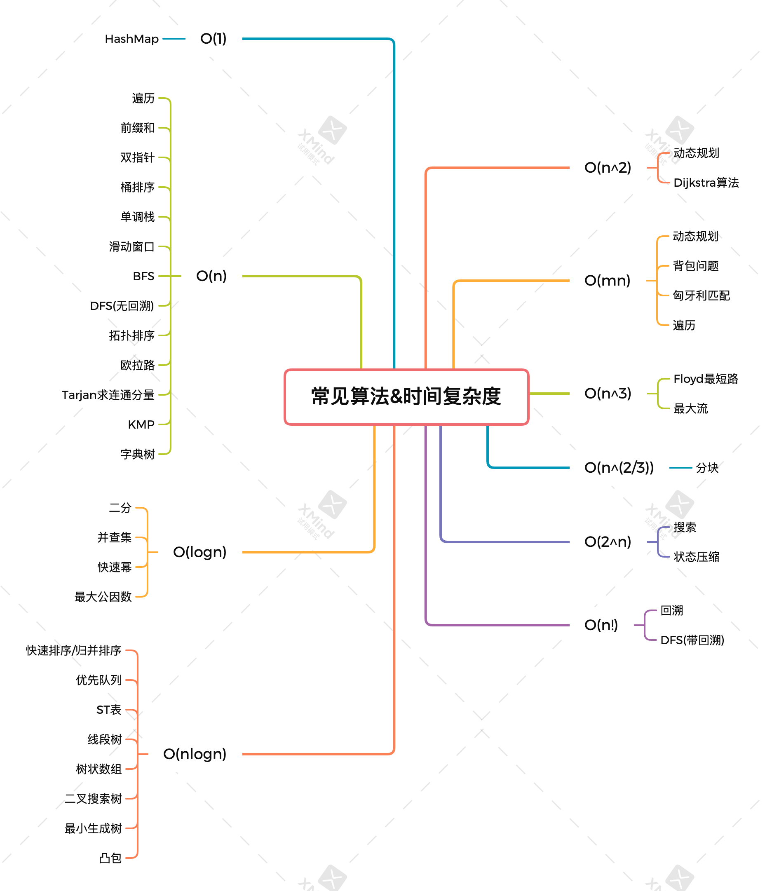
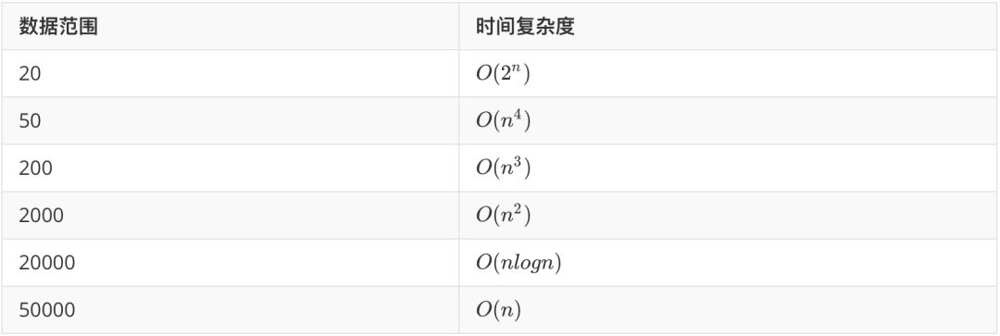

这是力扣经验贴，纯刷题经验总结，我个人是一个偏实战，经验主义者，所以想写下此文记录我的一些刷题心得。截止到目前为止，我刷了70道hard，120道normal，以下是一些个人对于如何刷题的看法。

先上几张时间复杂度的图：

数据结构猜测：

* 如果没有在下面出现的，基本是**模拟**。

* 涉及到字符串匹配的，比如说回文串，公共串，甚至直接是匹配两个串，这种需要双边比较串的，基本是**DP**。
* 涉及到状态依赖的，或者说需要区间更新的，后者依赖于前者计算的，基本是**DP**。
* 涉及到无法直接求解，或者无法模拟，只能推算的，基本是**DP**。（很重要的一点
* 涉及到动态范围更新的，尤其是动态更新求最值的，基本是**优先队列**。
* 涉及到多路排序的，比方说合并多个有序数组之类的，基本是**优先队列**。
* 涉及到从过去已有状态/数据选取最值的，基本是**优先队列**。
* 涉及到中位数问题的，尤其是动态数组求中位数的，基本是**两个优先队列**。
* 涉及到极其苛刻的时间复杂度的，比如数据范围很大，基本是**二分**。
* 涉及到求后面/前面第一个大于/小于当前数的，基本是**单调栈**。
* 涉及到极其苛刻的时间复杂度的，同时需要区间更新的，基本是**滑动窗口**。
* 涉及到计算区间存在性的，基本是**滑动窗口**。
* 涉及到配对的，比如括号合法性校检，表达式拆分计算的，基本是**栈**。
* 涉及到有限选择的，比如载重有限，空间有限，成本有限，且还要最优解的，基本是**背包**。
* 涉及到当前区间不可求解，需要对内部区间、旁侧区间进行求解的，一般是**回溯**。

处理技巧：

* 涉及到逆向还原的，可以使用**递归返回时执行流反向**的特性实现。（Spring对于AOP通知设置拦截器链便是如此
* 涉及到路径记录的，可以使用记录“**从哪里来**”实现。
* 涉及到优先队列的，如果移除队首元素成本很高的，可以使用**延迟删除**。
* **滑动窗口**一般都是**求解最短**的情况，如果涉及到最长的区间求解，请慎重考虑。
* 如果真的，我说真的一点思绪都没有，不妨排个序，排序的时间复杂度一般可以接受，而且排序可以解决很多时间复杂度问题。

