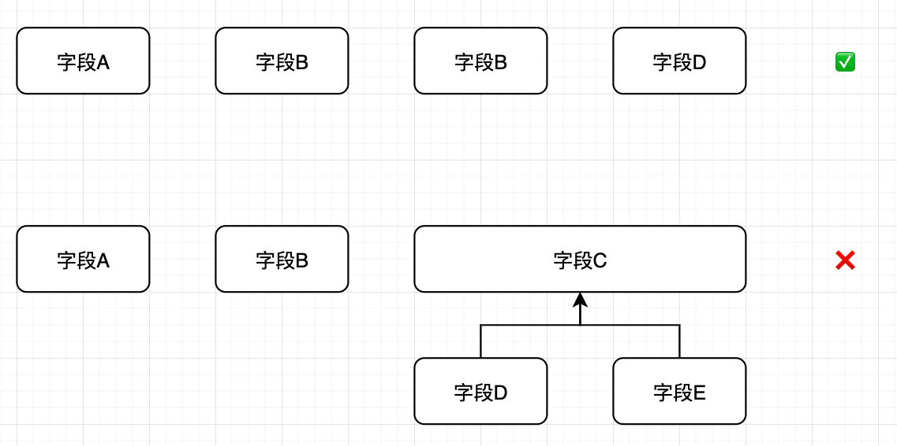
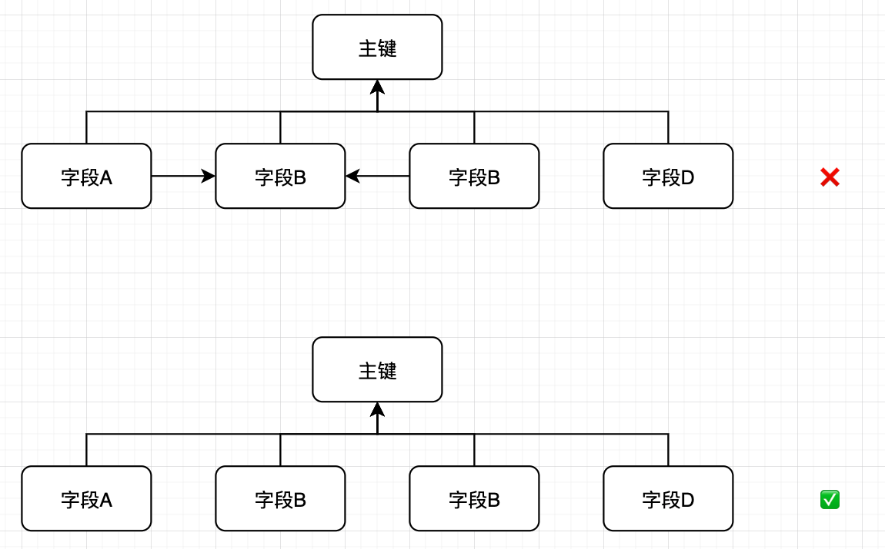
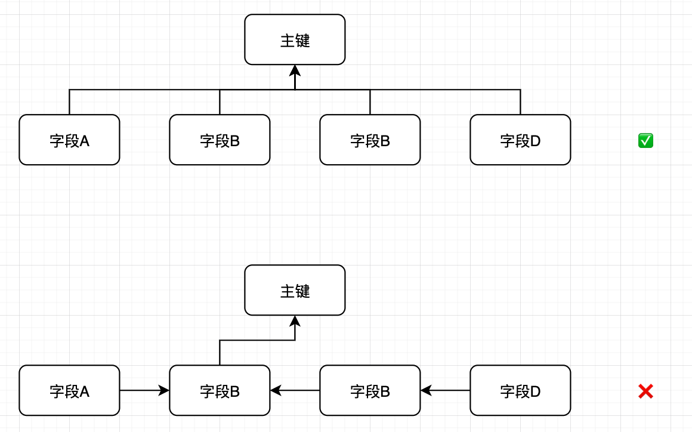

### MVCC

MVCC实现浅谈

* InnoDB为每个数据行后面添加了两个隐藏列：事务ID和回滚指针。
* 事务ID指出这个数据是由哪个事务创建的/更改的；回滚指针指向undo log中这行数据对应的回滚行。
* undo log中的回滚行由多个不同版本的回滚行组成，它们彼此之间通过回滚指针连接，就像链表。
* 每次使用MVCC时，InnoDB会为当前读事务生成一个read view，又称“活跃事务不可见视图”，指出了哪些回滚行可以被读取，哪些不可以。
* read view有四个字段，分别是max，min，curr，set；分别表示目前活跃事务中最大的事务的ID，最小的事务ID，当前事务的ID，以及活跃事务集；
* 既然是活跃事务，那铁定没有提交，所以根据隔离性肯定不可见。
* 遍历undo log，找到这样一个回滚行，使得它的(ID < min) || (min < ID < max && 不在set中)，这个就是我们需要找的快照数据，读取即可。

### 数据库三范式

第一范式要求字段不可拆分，每一个字段都是原子性的，比如家庭住址可以拆分为省-市-区，这是不对的。

第二范式要求字段之间不能存在依赖关系，所有的字段只能依赖主键。

第三范式要求字段不能间接通过另一个字段依赖主键，必须直接依赖主键。

